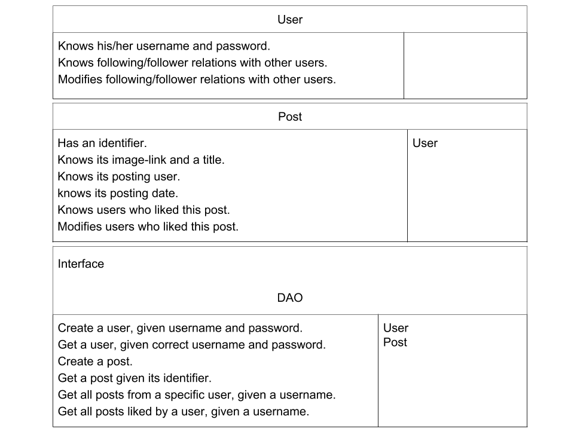
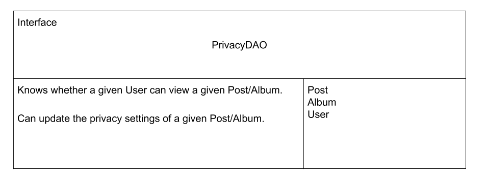

# CSC301, Week 5, Tutorial

For this tutorial, we will go through an example of CRC cards, and how to use them to “play out a scenario”. This is similar to what you were asked to do for the current phase of the project.

## Our Case Study

Our product is a photo sharing app. That is, we’re building Instagram, as if it didn’t already exist.    
This is not the most original idea, but, since we already understand the product, we can focus on CRC cards, and playing out scenarios.

## User Stories

1. As a user, I want to view a specific post when someone sends me a link to it.
2. As a user, I want to view posts from other users.
3. As a non-registered user, I want to register.
4. As a registered user, I want to login, so that I can create posts.
5. As a logged in user, I want to create posts.
   *  A post has a link to an image and a title.
   * We are assuming that the image has already been uploaded somehow, and is available online.
6. As a logged in user, I want to see all of my posts.
7. As a logged in user, I want to view my posts in order of their posting date.
8. As a logged in user, I want to “like” a post.
9. As a logged in user, for each of my posts, I want to know who liked them.
10. As a logged in user, I want to follow other users.
11. As a logged in user, I want to see posts that are liked by the people I am following.
12. As a logged in user, I want to organize my posts into albums, to allow other users to browse my photos more conveniently.
13. As a logged in user, I want to control the visibility options of my photos, so that I can determine who can view my photos:
    * Everybody
    * Logged-in users only
    * My followers
    * Specific users that I choose
14. As a logged in user, I want to control the visibility options of my albums.
15. As a user, I want to search for posts using text tags, so that I can see all posts related to a specific tag/topic.

Notice that some of these stories belong in the first iteration, some in the first release, some in the MVP, and some will be relevant in the future (e.g. Advanced search functionality only makes sense when there is enough data).

## CRC Cards - First attempt

### Scenarios

 * As a user, I want to view a specific post when someone sends me a link to it.
   * Posts have an identifier, so we should be able to create a link.
   * Unfortunately, right now, there is no way to get a post by its id.
 * As a user, I want to view posts from other users.
   * Given a User, we can get his/her posts.
 * As a non-registered user, I want to register.
   * Create a new User with a username and password.

### Issues

 * We don’t have a way to get a post by its id.

 * Usernames should be unique.
   * That should remind you of the problem we had with the unique names for TrainCompany in exercise 1.
   * Last week, we saw two solutions:
     * Making the constructor non-public, and providing public static access methods.
     * Using a DAO
   * CRC cards don’t have the notion of static methods, because a card represents an instance of a given class.

 * We have only 2 classes, and we already created a cyclic dependency.
   * Cyclic dependencies make unit tests harder to implement - In order to test one class in a cycle, we need all classes in the cycle. 
   * Let's think about the domain that the software is trying to model - A user exists regardless of their posts, so why should the User class depend on the Post class?

## CRC Cards - Second attempt

On the one hand, with CRC cards, we want to focus on the domain objects, not on the implementation of general design patterns. On the other hand, we need ways to access our User/Post instances, and it shouldn’t be the responsibilities of the User/Post instances themselves.    
Our trade-off ... We will define one “utility” CRC card - The DAO interface.

### Scenarios

 * As a user, I want to view a specific post when someone sends me a link to it.
   * Use a Post’s identifier to create a link.
   * Use a DAO to get a post by its identifier (that is a part of a link).
 * As a non-registered user, I want to register.
   * Use the DAO to create a new User with a username and password.
 * As a registered user, I want to login, so that I can create posts.
   * Use the DAO to login.
 * As a logged in user, I want to view my posts in order of their posting date.
   * From my User instance, I can get my username.
   * I can pass my username to the DAO, and get all of my posts.
   * Since each post knows its posting date, I can sort the posts.

## CRC Cards - Adding Functionality

Let's add some more functionality, in order to be able to play out more scenarios.

With CRC cards, we focus on the domain model, not on the details of the implementation. Therefore, when designing CRC cards, we will add responsibilities to a class as long as we are not creating new dependencies. When we actually implement the code, we might decide to move some of these responsibilities to utility classes (e.g. The whole social layer can move to its own DAO).

## What’s next?

Keep on going, until we satisfy all/most of the user stories.

User stories 13 and 14 (the ones that mention privacy settings) are particularly interesting.
 * If the only requirement was to be able to mark a post as public or private, we would be able to get away with adding the following responsibility to the Post/Album classes:
   * Knows whether it is public or private.
 * Once we want more flexible privacy features, a good solution would be to use a _PrivacyDAO_ interface:
 

 * Notice how we abstracted away all of the complexity related to privacy settings, while allowing ourselves to keep designing our domain objects.

## Some more extra notes

 * Later, we may want to break the DAO into two different interfaces (UserDAO, PostDAO). Why?
   * Organizing the code.
   * Allowing us to test things in smaller chunks.
   * Allowing us to use different data storages for different types of data.
 * As we implement the system, and the product becomes more complex, more functionality will move to the DAO.
   * Domain objects will become simpler.
   * We will get a “higher resolution” model of the real-world problem.      
     For example: A post is just a container for some content, the social layer on top of it (i.e. likes) is a completely separate concept.
 * We always want to be careful and not over-engineer early on.

